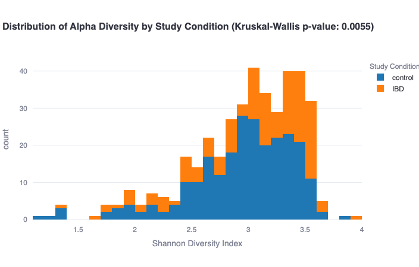
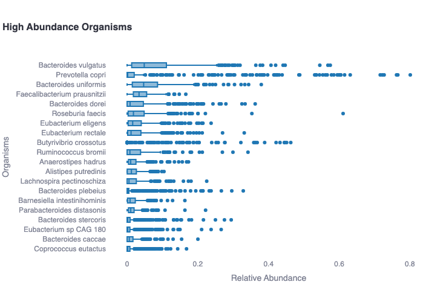
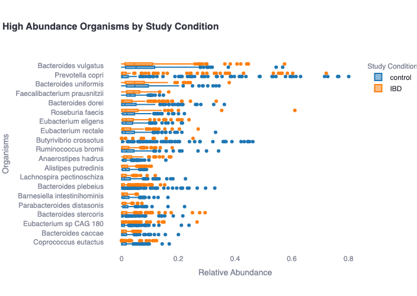
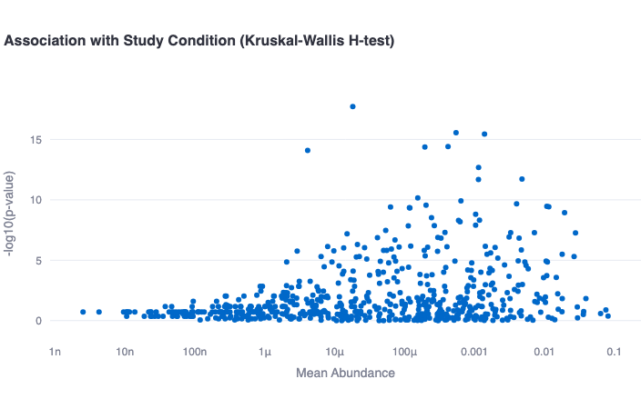
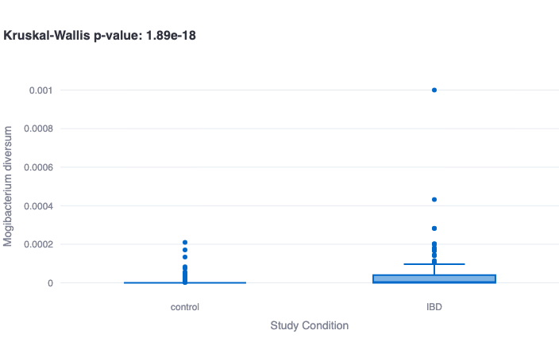

[**Microbiome Report: Data Gallery**](/post/microbiome-report-gallery)

[**Microbiome Report: Build Your Own**](https://mudata-explorer.streamlit.app/load_microbiome)

---

The Microbiome Report is a common collection of analyses performed on microbiome
datasets when the analysis goal is to identify individual microbes or combinations of
microbes which are associated with a particular group of samples. 

> The concept of **association** in this context refers to a consistent pattern of having
an overall relative abundance in a particular group which is either higher or lower
than the relative abundance in a comparison group.

## Analysis Steps

- Calculating summary metrics for each microbe (mean, std, etc.)
- Calculating alpha diversity ([Shannon](https://en.wikipedia.org/wiki/Diversity_index#Shannon_index))
- Performing [Principal Component Analysis (PCA)](https://scikit-learn.org/stable/modules/generated/sklearn.decomposition.PCA.html)
- Spatial embedding ([UMAP](https://umap-learn.readthedocs.io/en/latest/))
- Unsupervised clustering ([Leiden](https://www.nature.com/articles/s41598-019-41695-z))
- Identify organisms associated with cluster labels ([Kruskal-Wallis H Test](https://en.wikipedia.org/wiki/Kruskal%E2%80%93Wallis_test))
- For user-specified _categorical_ covariates (e.g. 'treatment' vs. 'control'), identify individual organisms associated with group labels ([Kruskal-Wallis H Test](https://en.wikipedia.org/wiki/Kruskal%E2%80%93Wallis_test))
- For user-specified _continuous_ covariates (e.g. age), identify individual organisms associated non-parametrically with scalar value ([Spearman rank correlation coefficient](https://en.wikipedia.org/wiki/Spearman%27s_rank_correlation_coefficient))

## Figures

The figures shown below are examples from the NielsenHB 2014 dataset from
the [curatedMetagenomicData project](https://waldronlab.io/curatedMetagenomicData/).
This data consists of 396 samples in total, 248 samples in the control group and 148
from individuals with Inflammatory Bowel Disease (IBD).
The collection of living figures shown below may be viewed and edited
[at this link](https://mudata-explorer.streamlit.app/load?file=https%3a%2f%2fgithub.com%2fCirroBioApps%2fmudata-examples%2fraw%2fmain%2fdata%2fcuratedMetagenomicData%2fdata%2fNielsenHB_2014%2fNielsenHB_2014-0-study_condition-c43ffe639cfaac01.h5mu).

## Making Changes

As with [all Living Figures](/post/what-are-living-figures), the displays in the
Microbiome Report may be edited and those changes may be saved and shared with
collaborators.

For a longer description of how to make changes, read the overall description
of [the Living Figures project](/post/what-are-living-figures).

---

[**Microbiome Report: Data Gallery**](/post/microbiome-report-gallery)

[**Microbiome Report: Build Your Own**](https://mudata-explorer.streamlit.app/load_microbiome)

