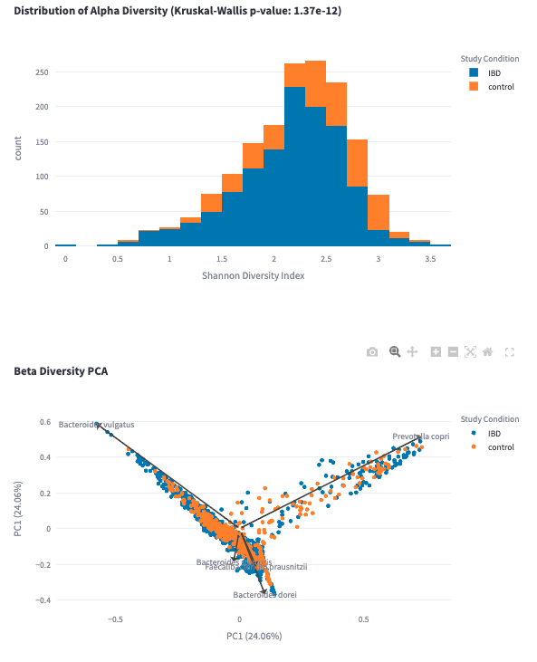
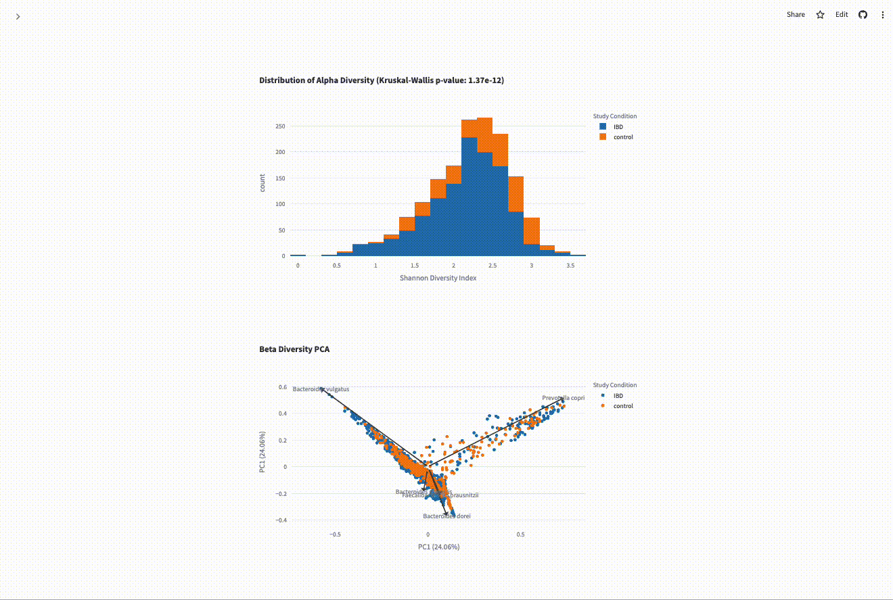
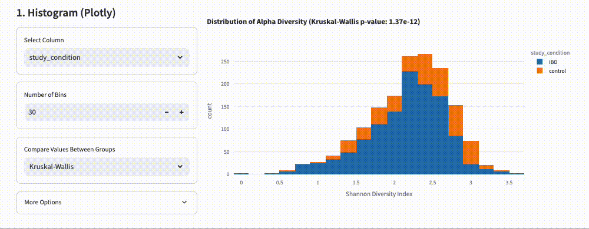
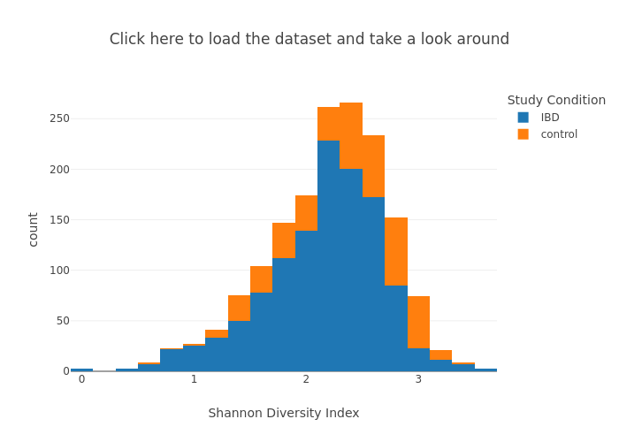

The _lingua franca_ of science and research are data visualizations
known as 'figures' - scatter plots, bar charts, heatmaps, and other
commonly used pictures which are used to describe characteristics
of a dataset.
While they are usually distributed as static images it can be useful
to have some way of making changes and modifying the figures,
following your curiosity about the question at hand.

This website describes a software project which is trying to make
it easier to publish figures which are editable and redistributable,
effectively living a new life in the hands of each viewer.
This project, the
[mudata-explorer](https://github.com/CirroBioapps/mudata-explorer/)
combines the flexibility of the
[AnnData](https://anndata.readthedocs.io/)/[MuData](https://mudata.readthedocs.io/en/latest/)
data structures with a simple syntax for displaying common figure
types.
Because the JSON schema for each figure can be embedded within the
MuData object and saved in
[HDF](https://en.wikipedia.org/wiki/Hierarchical_Data_Format) file
format (`*.h5mu`), it becomes quite easy to distribute both figures
and their source data as an integrated package.

## Viewing Figures

    

        
When you open a dataset, it may display a set of figures like this: a histogram and a scatterplot

    

    

        
    

## Opening the Sidebar

Using the menu on the left, you can open the sidebar to access a set
of controls used for modifying each figure.

## Using the Sidebar

The sidebar controls let you quickly modify the figure, which draws
on the source data to provide as much flexibility as possible.

## More Options

In addition to the settings displayed in the sidebar, you may update
the full list of settings for the figure (including which source data
elements are being bound to each figure axis) by selecting "Edit All"
in the "More Options" menu.

The user may also:

- Rearrange, duplicate, and delete any figures
- Add new figure or text elements
- Save the image as PDF/SVG/PNG

## Get Started

    

## Sharing Your Work

Using the menu on the left you can:

- Save or load the dataset to/from a file on your computer
- Save or load the dataset to the [Cirro data platform](https://cirro.bio)
- Hyperlink to a dataset available on the web
